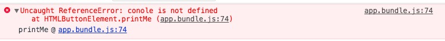
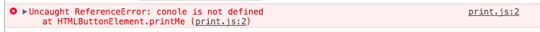

[1]  
``` javascript
  import join from 'lodash/join';
  // vs
  let _ = require('lodash');
```
`bundle.js` will differnet a lot. Since `let _ = require('lodash');` include all `lodash` code.
<br>

[2]
``` javascript
function writeSomething () {
  let _ = require('lodash');

  const element = document.createElement('div');
  
  element.innerHTML = _.join(['hello,', 'webpack'], ' ');

  return element;
}

// document.body.appendChild(writeSomething());
```

In above example, although we do not execute `writeSomething`, all `lodash` code were bundled into `bundle.js`. `require` in `webpack` is not the sample as the `require` in `node.js`. The `require` in `webpack` cannot dynamic load module like the `require` in `node.js`.
<br>

[3]
> Note that `webpack` **will not** alter any code other than `import` and `export` statements. If you are using other `ES2015` features, make sure to use a transpiler such as `Babel` or `Bublé` via `webpack`'s loader system.
<br>

[4]
Without `source map` configuration in `webpack`, when error occurs, console info will look like this:

After add config
``` javascript
devtool: 'inline-source-map'
```
Again, exact error location will display:

<br>

[5] Loaders
> webpack treats every file (.css, .html, .scss, .jpg, etc.) as a module. However, **webpack itself only understands JavaScript**.
**Loaders in webpack transform these files into `modules` as they are added to your dependency graph**.

> Loaders are **transformations** that are applied on the source code of a module. They allow you to **pre-process** files as you `import` or “load” them.

<br>

[6]Plugins
> While Loaders only execute transforms on a per-file basis, plugins are most commonly used to perform actions and custom functionality on "compilations" or "chunks" of your bundled modules (and so much more!).

> Plugins are the **backbone** of webpack. webpack itself is built on the same plugin system that you use in your webpack configuration!

